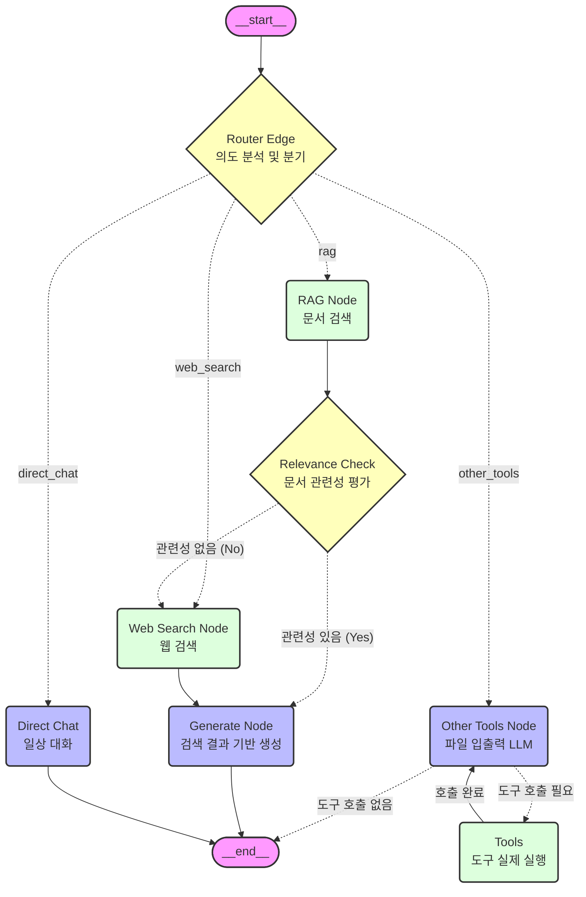

# Agent Workflow Diagram (Router Pattern)

현재 구현된 라우터 중심 아키텍처의 노드와 흐름을 나타내는 다이어그램입니다.

```mermaid
graph TD
    classDef start_end fill:#f9f,stroke:#333,stroke-width:2px;
    classDef router fill:#ffb,stroke:#333,stroke-width:2px;
    classDef process fill:#bbf,stroke:#333,stroke-width:2px;
    classDef action fill:#dfd,stroke:#333,stroke-width:2px;

    START([__start__]):::start_end
    END([__end__]):::start_end
    
    router{Router Edge\n의도 분석 및 분기}:::router
    
    rag_node(RAG Node\n문서 검색):::action
    web_search_node(Web Search Node\n웹 검색):::action
    other_tools_node(Other Tools Node\n파일 입출력 LLM):::process
    direct_chat_node(Direct Chat\n일상 대화):::process
    generate_node(Generate Node\n검색 결과 기반 생성):::process
    
    tools(Tools\n도구 실제 실행):::action

    START --> router
    
    router -.->|"rag"| rag_node
    router -.->|"web_search"| web_search_node
    router -.->|"other_tools"| other_tools_node
    router -.->|"direct_chat"| direct_chat_node
    
    rag_node --> relevance_check{Relevance Check\n문서 관련성 평가}:::router
    relevance_check -.->|"관련성 있음 (Yes)"| generate_node
    relevance_check -.->|"관련성 없음 (No)"| web_search_node
    
    web_search_node --> generate_node
    
    other_tools_node -.->|도구 호출 필요| tools
    other_tools_node -.->|도구 호출 없음| END
    
    tools -->|호출 완료| other_tools_node
    
    generate_node --> END
    direct_chat_node --> END
```
